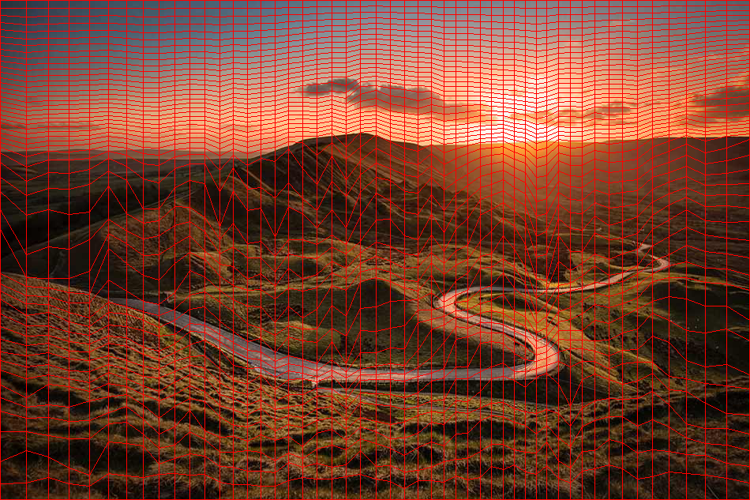

# ICDFI
## (Inverse CDF for Images)

This is a simple visualizer of the inverse CDF transformation. This can be used to gain an insight for how inverse transform sampling works, and by extension, how importance sampling works.




### Usage

```
ICDFI - Inverse CDF for Images

Usage:
python3 icdf_of_image.py <image file> [grid|overlay|cdf|cdf_x|cdf_y_given_x] <out file> [grid resolution]

Options:
grid - output an image with a grid representing the transformation of the U[0,1]^2 region CDF_inverse(<u,v>) -> <x,y>
overlay - output the same distorted grid, but overlay it on top of the source image
cdf - CDF of the image, with each pixel = p(x)p(y|x)
cdf_x - CDF of the image, only considering p(x)
cdf_y_given_x - CDF of the image, only considering p(y|x)

grid resolution - optional, defaults to 20
```
```
# an example:
python3 icdfi.py media/pdf0.png overlay media/icdf0.png 50
```
