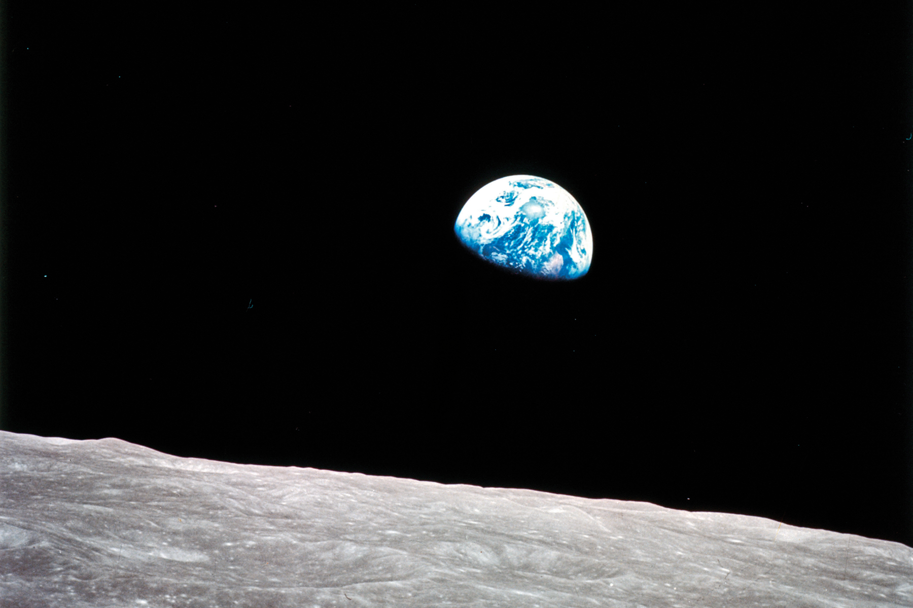
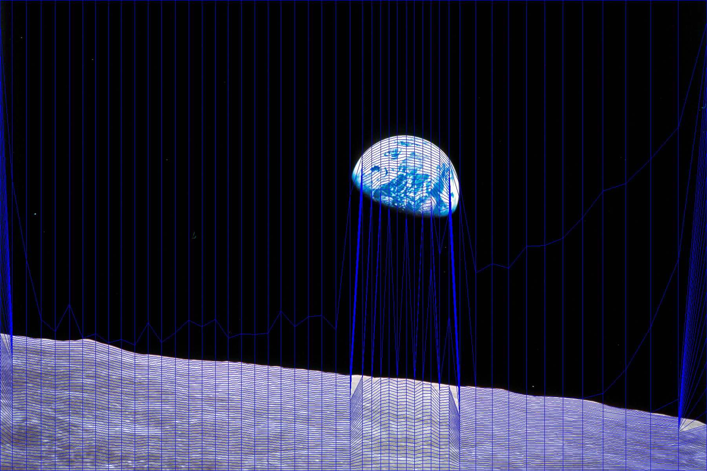
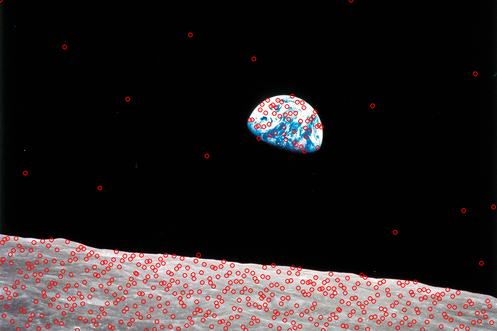
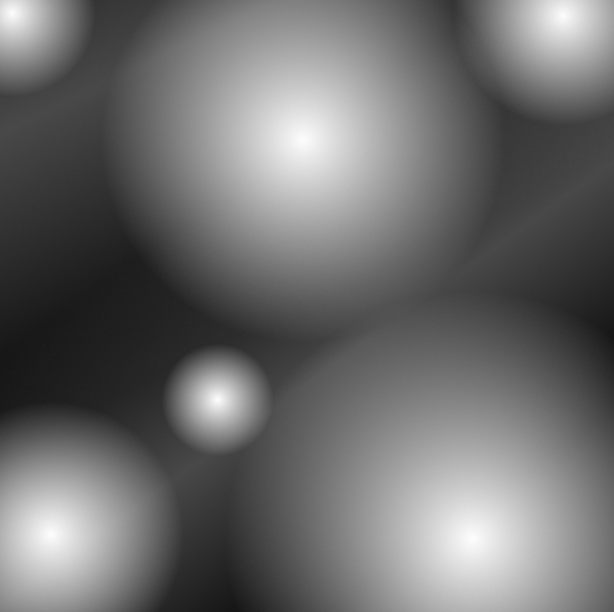
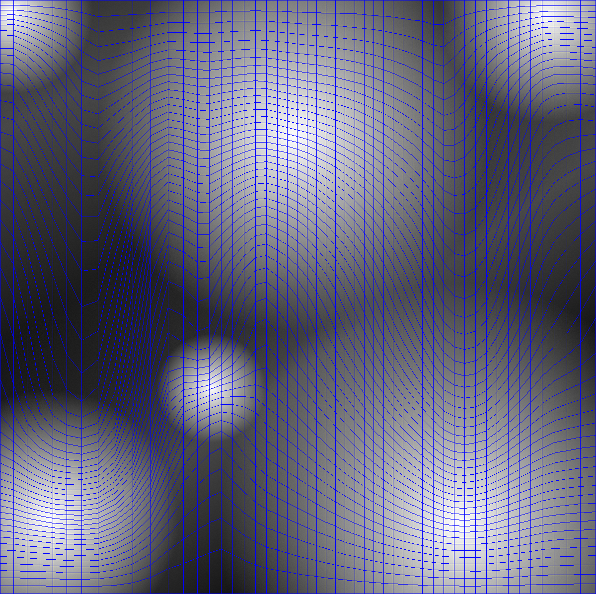
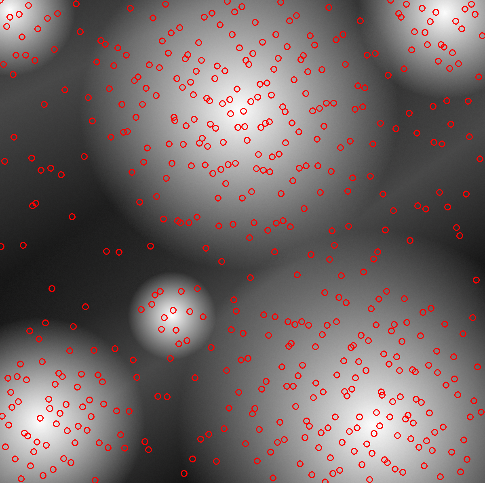

# ICDFI (Inverse CDF for Images)

This is a simple visualizer of the inverse CDF transformation. This can be used to gain an insight for how inverse transform sampling works, and by extension how importance sampling works.

There are two main scripts:
- `icdf_from_image.py`, which generates ICDF / importance sampling visualizations from images
- `icdf_varying_pdf.py`, which renders a video of CDF with varying PDF

[Click here to see a video of the varying PDF animation.](https://www.youtube.com/watch?v=3y6-SvS8N4Q)









### Usage

```
ICDFI - Inverse CDF for Images

Usage:
python3 icdf_of_image.py <image file> [grid | overlay | samples | cdf | cdf_x | cdf_y_given_x] <out file> [grid resolution | number of samples]

Options:
    grid - output an image with a grid representing the transformation of the U[0,1]^2 region CDF_inverse(<u,v>) -> <x,y>
    overlay - output the same distorted grid, but overlay it on top of the source image

    sampling - scatter dots in uv space, then transform with inverse CDF. Visualizes importance sampling.

    cdf - CDF of the image, with each pixel = p(x)p(y|x)
    cdf_x - CDF of the image, only considering p(x)
    cdf_y_given_x - CDF of the image, only considering p(y|x)

    grid resolution - optional, defaults to 20
    number of samples - optional, defaults to 20
```
```
# examples:
python3 icdf_from_image.py media/pdf4.png sampling media/pdf4_sampling.png 500
python3 icdf_from_image.py media/pdf4.png overlay media/pdf4_overlay.png 50
```

```
ICDF w/ Varying PDF Animation
- This could take around 20 minutes with default settings. To make it faster, lower the resolution or decrease the frame count
- Feel free to edit the PDF function in this script; it's arbitrary.

Usage:
python3 icdf_varying_pdf.py <video_output_path>.avi
```
